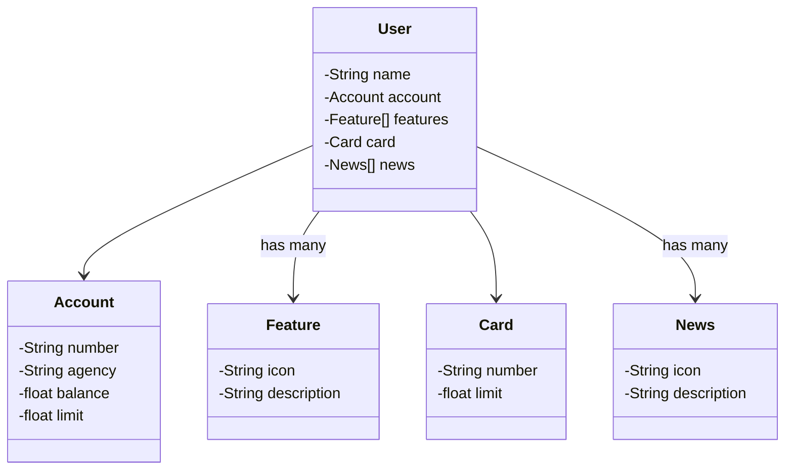

# Projeto Dio Java Spring Boot

```mermaid

classDiagram
    class User {
        -String name
        -Account account
        -Feature[] features
        -Card card
        -News[] news
    }

    class Account {
        -String number
        -String agency
        -float balance
        -float limit
    }

    class Feature {
        -String icon
        -String description
    }

    class Card {
        -String number
        -float limit
    }

    class News {
        -String icon
        -String description
    }

    User --> Account
    User --> Feature : has many
    User --> Card
    User --> News : has many
```